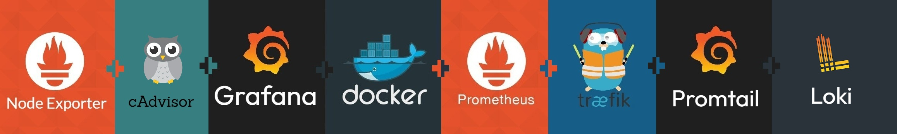

<h1 id="top" align="center">Monitor Loki <br/> 🚢 v1.1.0 🚢</h1>

<br>

<div align="center">
    
</div>

<br>

## 🔍 Table of Contents

- [Features](#features)
- [System Startup](#system-startup)

<br/>

<h2 id="features">🔥 Features</h2>

- **Docker Containerization:** The application is containerized using Docker to ensure consistent deployment, scalability, and isolation across different environments.
- **Docker Compose Deployment:** Simplifies deployment with Docker Compose configuration, enabling easy setup and service orchestration without complex commands.
- **Persistent Data:** Utilizes a named Docker volume to ensure persistent storage of application data, allowing data to persist across container restarts, rebuilds, and removals.
- **Network Compatibility:** Uses shared Docker network to work with other monitoring tools.
- **.env Configuration:** All environment variables are easily configurable using the `.env` file, simplifying configuration management.
- **Log Scraping:** Preconfigured scraping configuration for Promtail.
- **Traefik Integration:** Promtail collects logs directly from Traefik and push to Loki, enabling easy monitoring of your reverse proxy activity.
- **Grafana Integration:** Loki integrates smoothly with Grafana for visualizing access logs.

<br/>

<h2 id="system-startup">🚀 System Startup</h2>

- Create a new directory named `monitor`.

```
mkdir monitor
cd monitor
```

- Clone project.

```
git clone https://github.com/ahmettoguz/monitor-loki
cd monitor-loki
```

- Switch version.

```
git checkout v1.1.1
```

- Create `.env` file based on the `.env.example` file with credentails and configurations.

```
cp .env.example .env
nano .env
```

- Create `network-monitor` network if not exists.

```
docker network create network-monitor
```

- Manage container.

```
docker stop                     container-loki
docker rm                       container-loki
docker volume rm                volume-loki
docker compose -p monitor up -d service-loki
docker logs -f                  container-loki
```

- Refer to [`cAdvisor`](https://github.com/ahmettoguz/monitor-cadvisor) repository to expose contianer metrics.

- Refer to [`Node-Exporter`](https://github.com/ahmettoguz/monitor-node-exporter) repository to expose node metrics.

- Refer to [`Prometheus`](https://github.com/ahmettoguz/monitor-prometheus) repository to integrate prometheus to scrap metrics.

- Refer to [`Promtail`](https://github.com/ahmettoguz/monitor-promtail) repository to push traefik access logs to Loki.

- Refer to [`Traefik`](https://github.com/ahmettoguz/proxy-traefik) repository to expose traefik access logs, metrics and also launch reverse proxy.

- Refer to [`Grafana`](https://github.com/ahmettoguz/monitor-grafana) repository to integrate grafana to visualize logs and metrics.

<br/>

### [🔝](#top)
