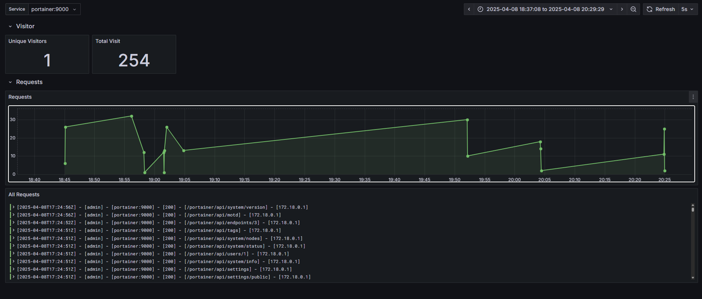

<h1 id="top" align="center">Monitor Loki</h1>

<br>

<div align="center">
    
</div>

<br>

## 🔍 Table of Contents

- [About Project](#intro)
- [Dashboard](#dashboard)
- [Technologies](#technologies)
- [Features](#features)
- [Releases](#releases)
- [System Startup](#system-startup)
- [Contributors](#contributors)

<br/>

<h2 id="intro">📌 About Project</h2>

This project simplifies the deployment of Loki, a log aggregation system, using Docker Compose. It includes a pre-configured setup for scraping logs from Promtail and integrates with Grafana for visualization.

<br/>

<h2 id="dashboard">🔥 Dashboard</h2>

<div align="center">
    
</div>

<br/>

<h2 id="technologies">☄️ Technologies</h2>

&nbsp; [](https://www.docker.com)

&nbsp; [](https://grafana.com/docs/loki/latest/send-data/Loki)

<br/>

<h2 id="features">🔥 Features</h2>

- **Docker Containerization:** The application is containerized using Docker to ensure consistent deployment, scalability, and isolation across different environments.
- **Docker Compose Deployment:** Simplifies deployment with Docker Compose configuration, enabling easy setup and service orchestration without complex commands.
- **Log Scraping:** Preconfigured scraping of container logs using Promtail or a similar agent.
- **Persistent Configuration:** Uses bind mounts to store Loki config and logs on the host machine.
- **Network Compatibility:** Uses shared Docker network to work with other monitoring tools.
- **Traefik Integration:** Promtail collects logs directly from Traefik, enabling easy monitoring of your reverse proxy activity.
- **Loki Integration:** Logs are pushed to Loki, which store logs and serves to Grafana to create visually appealing dashboards.
- **Grafana Integration:** Promtail integrates smoothly with Grafana for visualizing access logs.

<br/>

<h2 id="releases">🚢 Releases</h2>

&nbsp; [](https://github.com/ahmettoguz/monitor-loki/tree/v1.0.0)

<br/>

<h2 id="system-startup">🚀 System Startup</h2>

- Create a new directory named `monitor`.

```
mkdir monitor
cd monitor
```

- Clone project.

```
git clone https://github.com/ahmettoguz/monitor-loki
cd monitor-loki
```

- Create `mount` directory and change file permissions.

```
mkdir mount
chmod 777 mount
```

- Create `network-monitor` network if not exists.

```
docker network create network-monitor
```

- Run container.

```
docker stop                             monitor-loki-c
docker rm                               monitor-loki-c
docker compose -p monitor up --build -d loki
docker compose -p monitor up -d         loki
docker logs -f                          monitor-loki-c
```

- Refer to [`cAdvisor`](https://github.com/ahmettoguz/monitor-cadvisor) repository to expose contianer metrics.

- Refer to [`Node-Exporter`](https://github.com/ahmettoguz/monitor-node-exporter) repository to expose node metrics.

- Refer to [`Prometheus`](https://github.com/ahmettoguz/monitor-prometheus) repository to integrate prometheus to scrap metrics.

- Refer to [`Promtail`](https://github.com/ahmettoguz/monitor-promtail) repository to push traefik access logs to Loki.

- Refer to [`Traefik`](https://github.com/ahmettoguz/core-traefik) repository to expose traefik access logs, metrics and also launch reverse proxy.

- Refer to [`Grafana`](https://github.com/ahmettoguz/monitor-grafana) repository to integrate grafana to visualize logs and metrics.

<br/>

<h2 id="contributors">👥 Contributors</h2>

<a href="https://github.com/ahmettoguz" target="_blank"></a>

### [🔝](#top)
